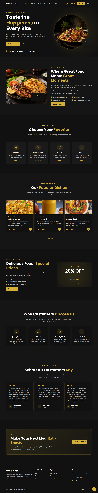
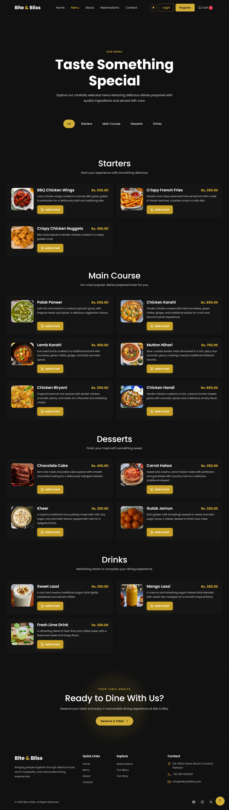
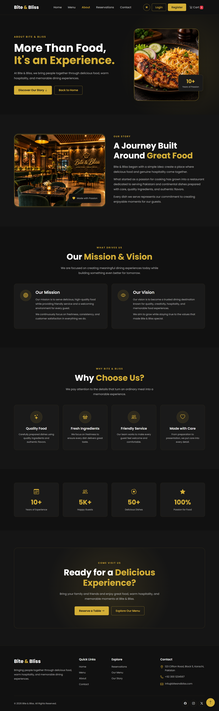
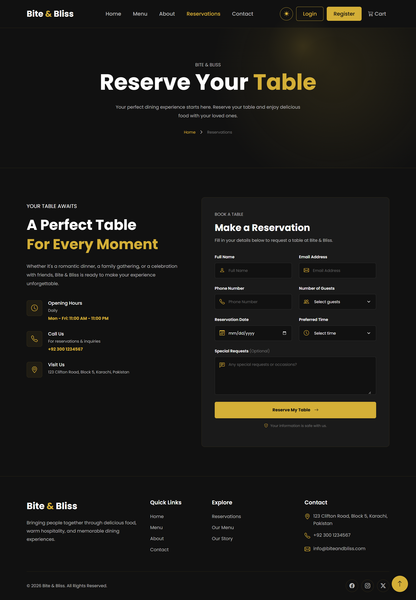
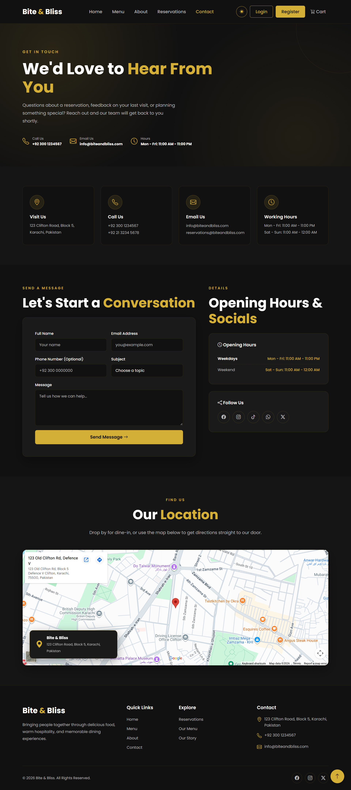
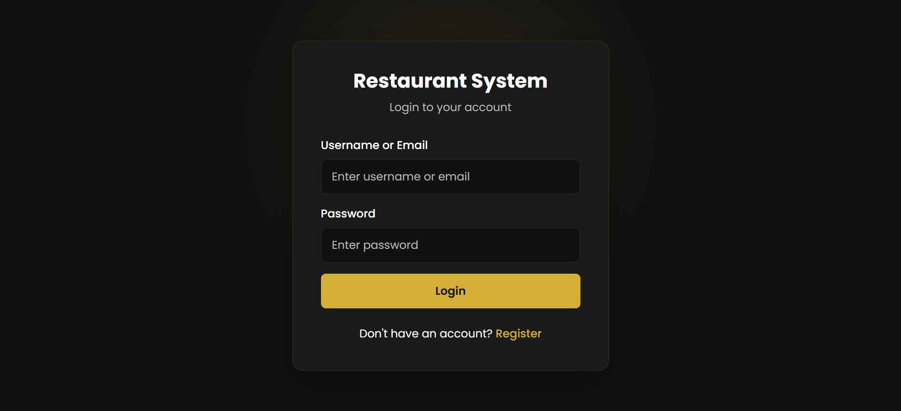
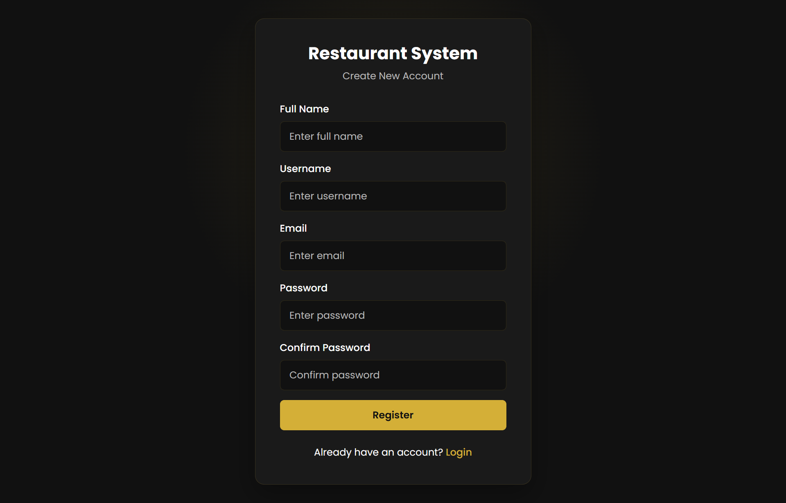
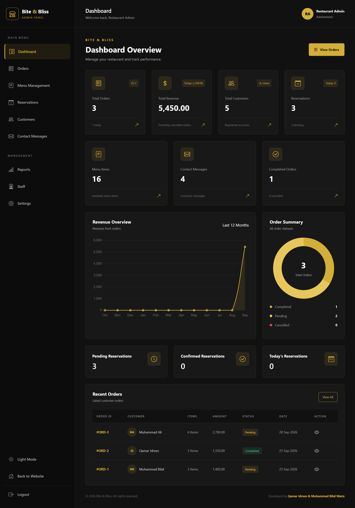
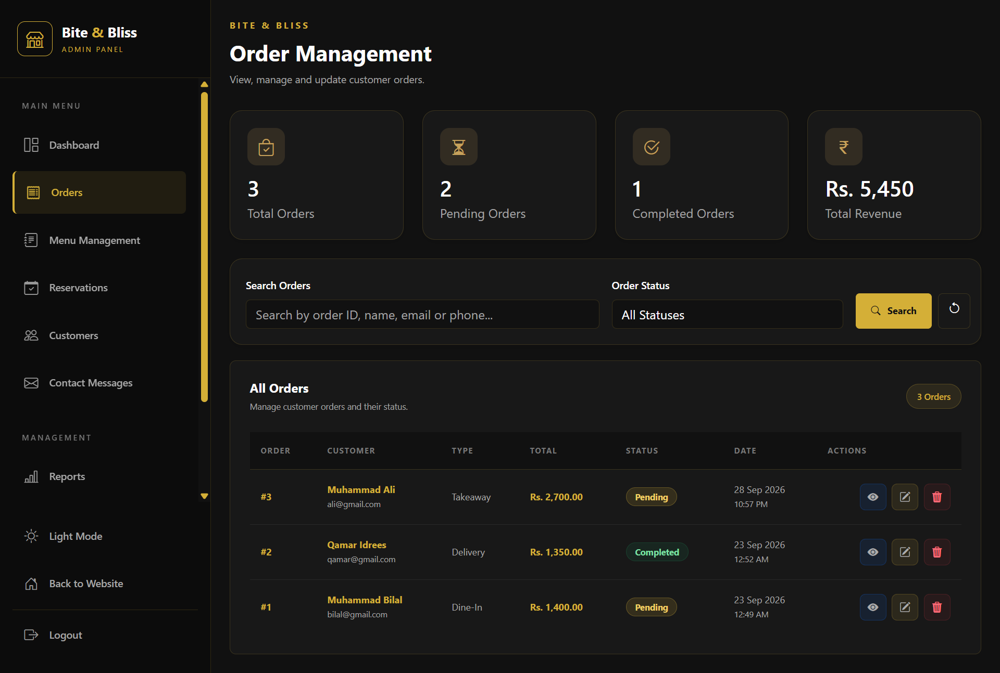

# 🍽️ Bite & Bliss Restaurant Management System

A modern, responsive, and full-stack **Restaurant Management System** developed by **Q&B Tech Studio** using PHP, MySQL, Bootstrap, HTML, CSS, and JavaScript.

Bite & Bliss provides a complete restaurant website experience for customers along with an admin panel for managing users, menu items, reservations, reviews, and other restaurant operations.

---

## 📸 Project Preview



---

## ✨ Features

### 👤 Customer Side

* 🏠 Modern and responsive homepage
* 📖 About Us page
* 🍽️ Dynamic food menu
* 🥗 Food categories
* 📅 Table reservation system
* 📩 Contact Us form
* ⭐ Customer feedback/reviews
* 🔐 User registration and login
* 🌙 Light/Dark mode
* 📱 Fully responsive design
* ✅ PHP-based form validation
* 🔒 Secure authentication

### 🔐 Admin Panel

* 📊 Admin dashboard
* 👥 User management
* 🍽️ Menu management
* 📅 Reservation management
* ⭐ Review/feedback management
* ➕ Add records
* ✏️ Edit records
* 🗑️ Delete records
* 🔍 View records
* 🔐 Admin authentication
* 🛡️ Role-based access control

---

## 🛠️ Technologies Used

### Frontend

* HTML5
* CSS3
* JavaScript
* Bootstrap 5

### Backend

* PHP

### Database

* MySQL

### Development Tools

* XAMPP
* phpMyAdmin
* Visual Studio Code
* Git
* GitHub

---

## 📸 Screenshots

### 🏠 Home Page


### 🍽️ Menu Page



### 📖 About Page



### 📅 Reservation Page



### 📩 Contact Page



### 🔐 Login / Register




### 📊 Admin Dashboard



### 👥 Admin Management



---

## 🗄️ Database

Bite & Bliss uses **MySQL** to store and manage application data.

The database handles information such as:

* Users
* Menu items
* Food categories
* Reservations
* Reviews
* Contact/restaurant-related data

Database interaction is handled using **PHP PDO**.

---

## 🚀 Installation & Setup

### 1. Clone the Repository

```bash
git clone https://github.com/qbtechstudio/restaurant_system.git
```

### 2. Move the Project

Place the project inside your XAMPP `htdocs` directory:

```text
C:\xampp\htdocs\restaurant_system
```

### 3. Start XAMPP

Start the following services:

```text
Apache
MySQL
```

### 4. Create the Database

Open:

```text
http://localhost/phpmyadmin
```

Create the required database and import the provided SQL file if included in the repository.

### 5. Configure the Database

Update the database credentials in the project's database configuration file.

Example:

```php
$host = "localhost";
$dbname = "restaurant_db";
$username = "root";
$password = "";
```

### 6. Run the Project

Open the following URL in your browser:

```text
http://localhost/restaurant_system/
```

---

## 🎯 Project Goals

The main purpose of Bite & Bliss was to build a practical full-stack restaurant application while implementing real-world web development concepts.

The project demonstrates:

* Responsive web design
* Component-based development
* PHP backend development
* MySQL database integration
* CRUD operations
* Authentication and authorization
* Form validation
* Admin dashboard development
* Database-driven content
* Frontend and backend integration

---

## 🔄 Main System Flow

```text
Customer
   │
   ├── Register / Login
   │
   ├── Browse Menu
   │
   ├── View Restaurant
   │
   ├── Make Reservation
   │
   └── Submit Feedback
            │
            ▼
        MySQL Database
            ▲
            │
        Admin Panel
            │
   ├── Manage Users
   ├── Manage Menu
   ├── Manage Reservations
   └── Manage Reviews
```

---

## 👨‍💻 Developed By

### Q&B Tech Studio

**TECH MEETS CREATIVITY**

Q&B Tech Studio is a web development and digital solutions studio focused on building modern, responsive, and functional digital experiences.

### Team

* **Qamar Idrees** — Co-Founder & Full Stack Developer
* **Muhammad Bilal Waris** — Co-Founder & Full Stack Developer

---

## 📌 Project Status

**Completed**

This project was developed as a full-stack web development project and may receive future improvements, optimizations, and additional features.

---

## ⭐ Support

If you like this project, consider giving the repository a ⭐ on GitHub.

---

**© 2026 Q&B Tech Studio**
